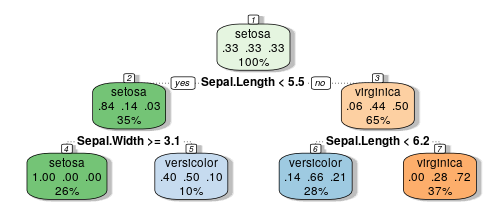

<!-- Change background of title page 
 https://stackoverflow.com/a/20876817
 -->

## Introduction 

* **Classification** **Tree** **Demo** allows the user to train a decision tree using the R library **caret**. 
* As an example plant species from the **iris** dataset that comes with R are classified. 
* Interactive elements include 
  * an **input box**  for the seed of the random number generator
  * a **slider** to change the amount of data that is used for training 
  * **radio buttons** to select the features that are used for the decision tree
  
* To start the model training click the **Train** button 
* The app will automatically train the model and plot the resulting decision tree as well as a visualisation of the prediction accuracy. 

---

## Classification Trees 
[Classification trees](https://en.wikipedia.org/wiki/Predictive_analytics#Classification_and_regression_trees_.28CART.29) are a machine learning algorithm often used for classification problems. 

The app uses the function ` fancyRpartPlot` from the **rattle** library to draw a nice looking graphical representation of the fitted model. An example is shown below. 

For this example **sepal** features and **70%** of the data were used for training. The random seed was **4582**. Try to reproduce the tree in the app!

--- 

## How does it work?
The app is generated using the **shiny** package, which makes it easy to build interactive web apps in R. [Here](https://shiny.rstudio.com/) is a good starting point for learning more about **shiny**.  

The machine learning parts of the app make heavy use of the [caret](http://topepo.github.io/caret/index.html) library,  which offers convenient functions for 
* [splitting data](http://topepo.github.io/caret/data-splitting.html) into training and test sets using `createDataPartition` 

* [training the model](http://topepo.github.io/caret/model-training-and-tuning.html) with `train`. For the app the `method="rpart2"` option is used to train a classification tree. 
* making predictions from the trained model with `predict`

Follow [this link](http://topepo.github.io/caret/train-models-by-tag.html) to learn more about tree models in the caret package. 

--- &radio

## Quiz 
Which of the following machine learning algorithms is mentioned in this presentation?  

1. Neural Network
2. Suport Vector Machine 
3. _Classification Tree_
4. Logistic Regression 

*** .hint
Look at the title slide!

*** .explanation
The answer is of course **Classification Tree**!

